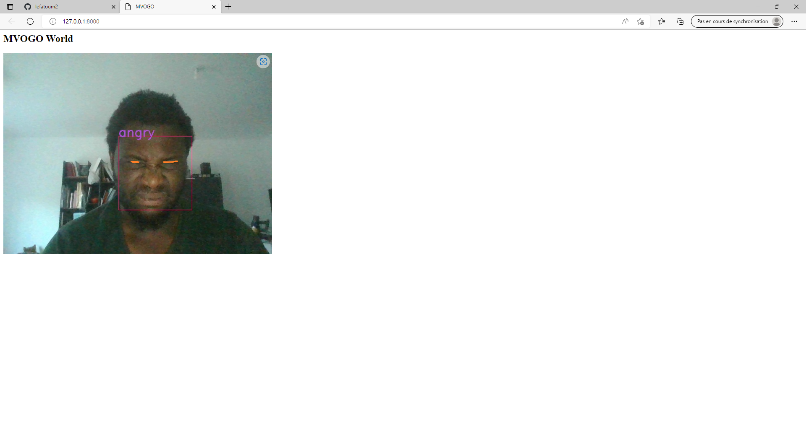
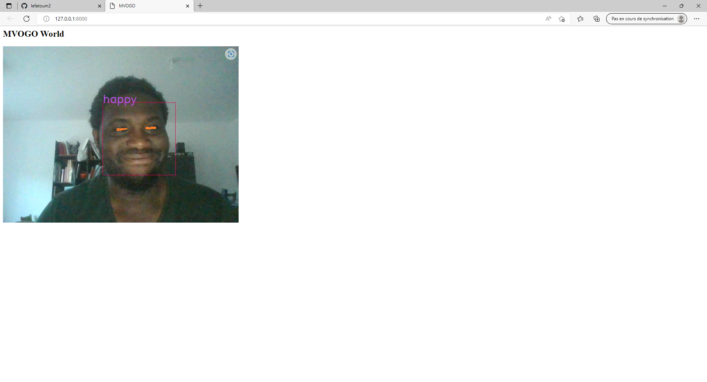
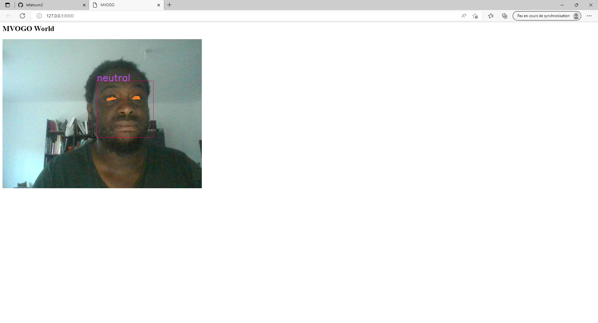

## Sujet 
Pour ce projet web , j'ai eu envie de combiner OpenCv pour la camera  et la librairie de reconnaissance faciale de Facebook, DeepFace dans une page web.
## Installation

```

pipenv shell
pip install django opencv-python
pip install deepface
```


```
django-admin startproject face_api
cd face_api django-admin startapp camera
```

settings.py :

```py
# Application definition

INSTALLED_APPS = [
    'django.contrib.admin',
    'django.contrib.auth',
    'django.contrib.contenttypes',
    'django.contrib.sessions',
    'django.contrib.messages',
    'django.contrib.staticfiles',
    'camera'
]
```

## Templates

base.html :
```html

<html>

<head>
    <title></title>
</head>

<body>
    

</body>

</html>
```

camera.html:
```html


 MVOGO 



<h2>{{ data }}</h2>



```

camera/camera.py:
```py
import cv2
face_cascade=cv2.CascadeClassifier(cv2.data.haarcascades + "haarcascade_frontalface_alt2.xml")
ds_factor=0.6

class VideoCamera(object):
    def __init__(self):
        self.video = cv2.VideoCapture(0)
    
    def __del__(self):
        self.video.release()
    
    def get_frame(self):
        success, image = self.video.read()
        image=cv2.flip(image,1)
        image=cv2.resize(image,None,fx=ds_factor,fy=ds_factor,interpolation=cv2.INTER_AREA)
        gray=cv2.cvtColor(image,cv2.COLOR_BGR2GRAY)
        face_rects=face_cascade.detectMultiScale(gray,1.3,5)
        for (x,y,w,h) in face_rects:
        	cv2.rectangle(image,(x,y),(x+w,y+h),(0,255,0),2)
        	break
        ret, jpeg = cv2.imencode('.jpg', image)
        return jpeg.tobytes()
```
camera/camera2.py :
```py
import cv2
from deepface import DeepFace
ds_factor=0.6
face_cascade = cv2.CascadeClassifier(cv2.data.haarcascades + "haarcascade_frontalface_default.xml")


class VideoCamera2(object):
    def __init__(self):
        self.video = cv2.VideoCapture(0, cv2.CAP_DSHOW)
    
    def __del__(self):
        self.video.release()

    def get_frame(self):
        _, frame = self.video.read()

        gray = cv2.cvtColor(frame, cv2.COLOR_BGR2GRAY)
        face = face_cascade.detectMultiScale(gray, scaleFactor=1.1, minNeighbors=5)

        for x, y, w, h in face:
            image = cv2.rectangle(frame, (x, y), (x + w, y + h), (89, 2, 236), 1)
            try:
                analyze = DeepFace.analyze(frame, actions=['emotion'])
                cv2.putText(image, analyze['dominant_emotion'], (x, y), cv2.FONT_HERSHEY_SIMPLEX, 1, (224, 77, 176), 2)
                print(analyze['dominant_emotion'])
            except:
                print('no face')
            
        ret, jpeg = cv2.imencode('.jpg', frame)
        return jpeg.tobytes()
```


face_api/urls.py:
```py
from django.conf import settings
from django.contrib import admin
from django.conf.urls.static import static
from django.urls import path, include

urlpatterns = [
    path('admin/', admin.site.urls),
    path('', include('camera.urls'))
]
```

camera/urls.py:
```py
rom django.urls import path
from .views import (
    camera_live,
    Camera)

urlpatterns = [
    path('', Camera.as_view(), name='camera'),
    path('video_feed/', camera_live, name='camera_live'),
]
```

camera/views.py:
```py
from django.shortcuts import render
from django.views import View
from django.http import HttpResponse , StreamingHttpResponse ,request


from .camera import VideoCamera
from .camera2 import VideoCamera2


def gen(camera):
    while True:
        frame = camera.get_frame()
        yield (b'--frame\r\n'
               b'Content-Type: image/jpeg\r\n\r\n' + frame + b'\r\n\r\n')

def camera_live(request):
    try:
        return StreamingHttpResponse(gen(VideoCamera2()), content_type="multipart/x-mixed-replace;boundary=frame")
    except:  
        pass

class Camera(View):
    template_name = 'camera.html'
    word = 'MVOGO World'

    def get(self, request):
        context = {
            'data': self.word
        }
        return render(request, self.template_name, context)
```


```
http://127.0.0.1:8000/
```

## Résultats




